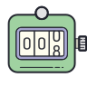

 

  

<h3 align="center">Counter | Scrimba</h3>

  

  A simple counter built with HTML, CSS and JavaScript 
     
     
    <a href="https://adrianogtl.github.io/scrimba-counter">View Demo</a>
    ·
    <a href="https://scrimba.com">Scrimba</a>
  

## :dart: About

* Coding challange from Scrimba's JavaScript course

## :memo: License

Distributed under the MIT License. See [LICENSE](LICENSE) for more information.

## :heart: Acknowledgments

* Icon by [Icons8](https://icons8.com)
* Photo from [Unsplash](https://unsplash.com)

<a href="#readme-top">Back to top :arrow_up: </a>

